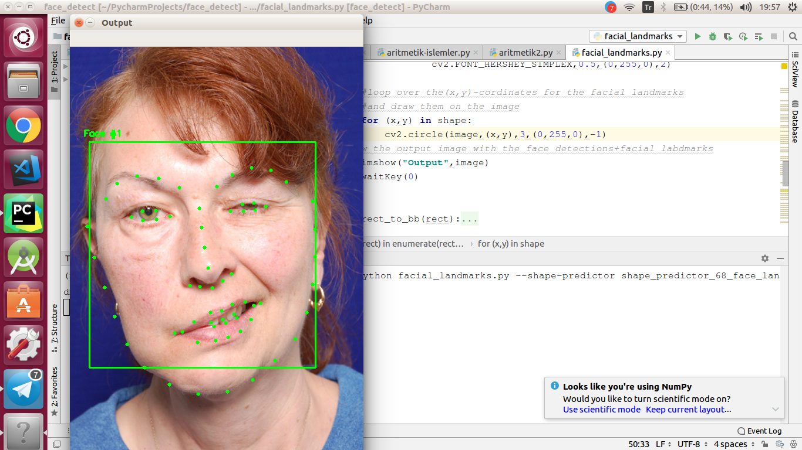

**FaCiPa: FACIAL PARALYSIS DIAGNOSIS ALGORITHM (Facial Landmarks 68 coordinates)** 

**Running the Application**
---------------

The versions used in the PyCharm IDE to run Python codes are listed below.

***Libraries and Packages to be Installed with Priority***

👉 Pip Package Manager

👉 Python 3.5 Version

👉 Flask for API if needed

-------------
***All Libraries and Packages in the Project***

✔️ Python Version:3.5

✔️ pip:19.1.1

✔️ flask:1.1.1

✔️ cmake:3.15.3

✔️ dlib:19.4.0 || latest version( 19.18.0 )

✔️ opencv-python:4.1.1.26

✔️ imutils:0.5.3

   In the project, facial paralysis algorithm is run based on 68 coordinate models. The code file that contains the algorithm and the shape-predictor model is facial_landmarks.py, and the Flask API code written for the mobile platform of the project is located in the api_trying.py file.

   If only the paralysis algorithm will be run, the photo to be detected on the imageP variable based on the file must be specified manually.
        
    > python facial_landmarks.py --shape-predictor shape_predictor_68_face_landmarks.dat \--image face.jpg
    
   If server-based work is to be done, it is sufficient to run the api_trying file.
    
    > python api_trying.py
   
**Setting Pip**

Setting Ubuntu 16.04 PIP

https://www.rosehosting.com/blog/how-to-install-pip-on-ubuntu-16-04/

**A view from the project:**

